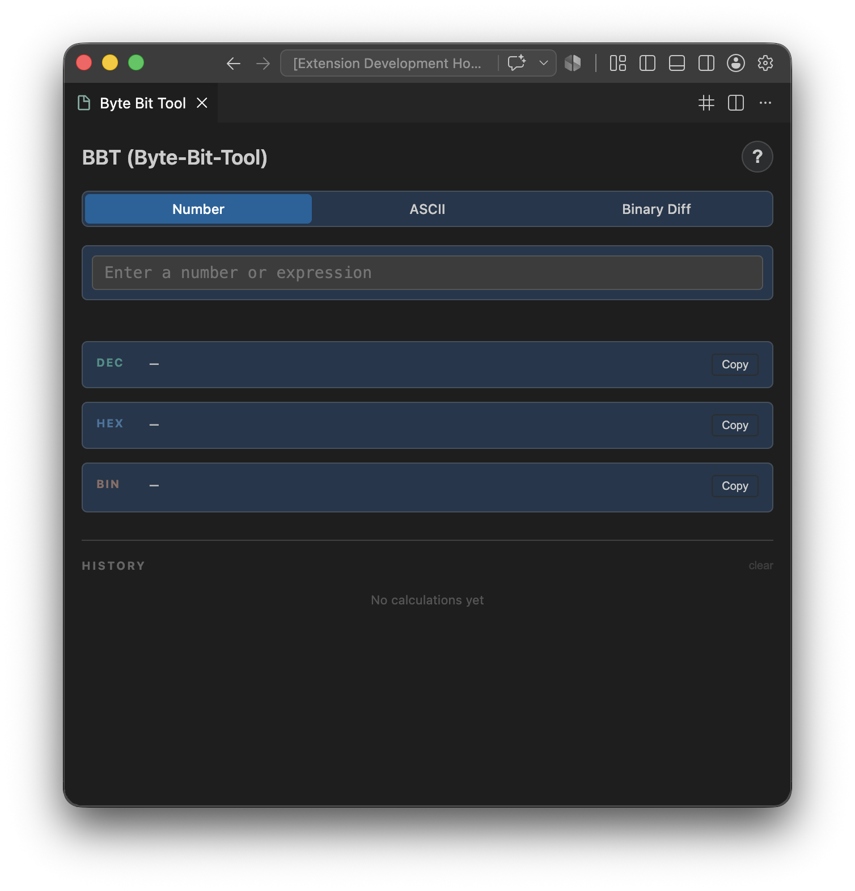
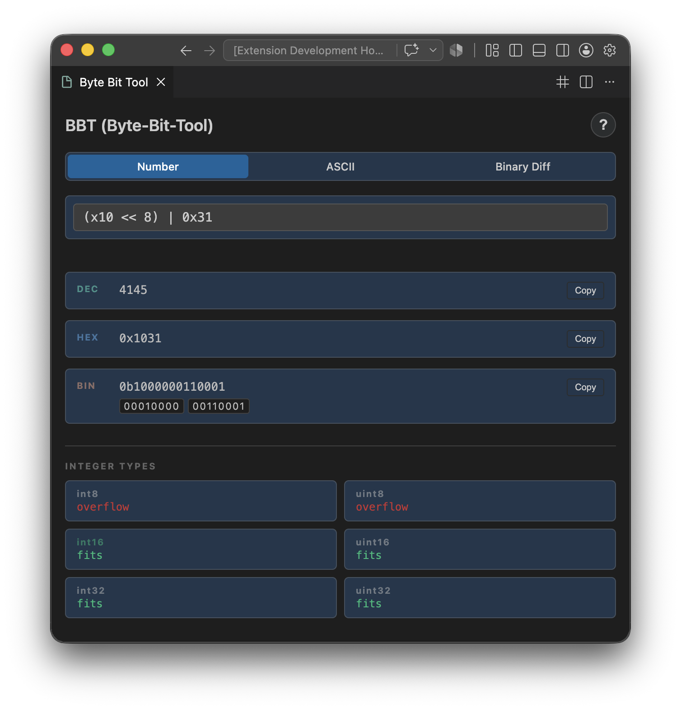
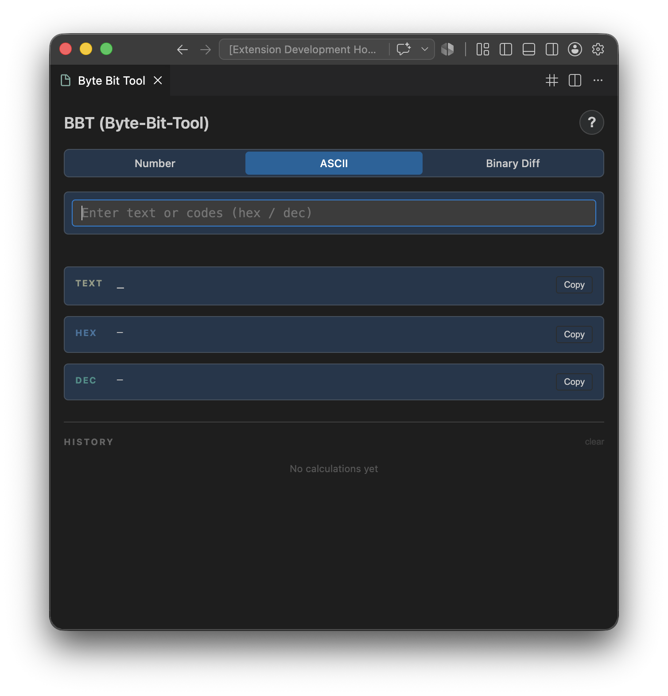
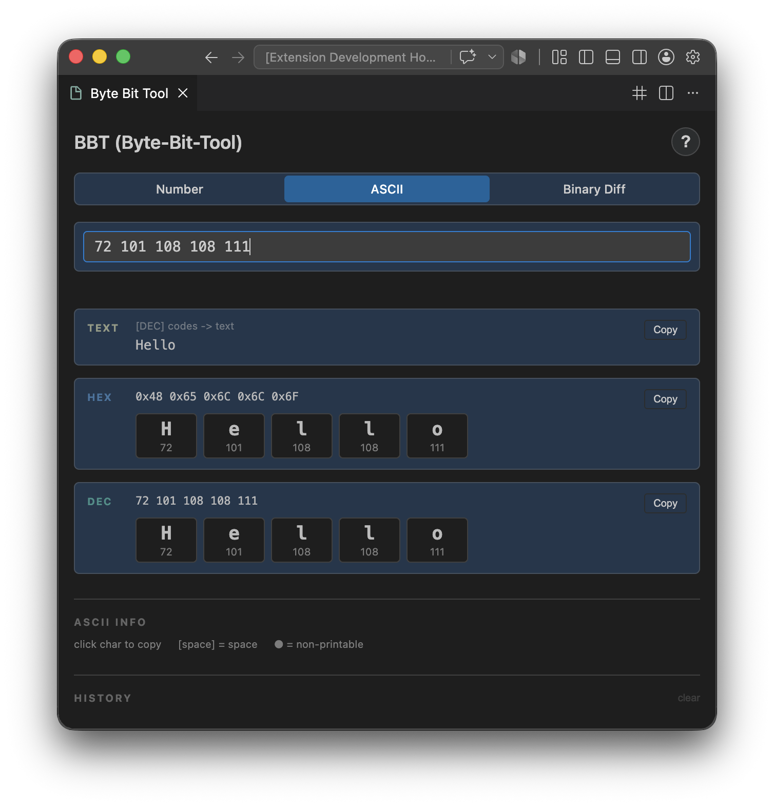
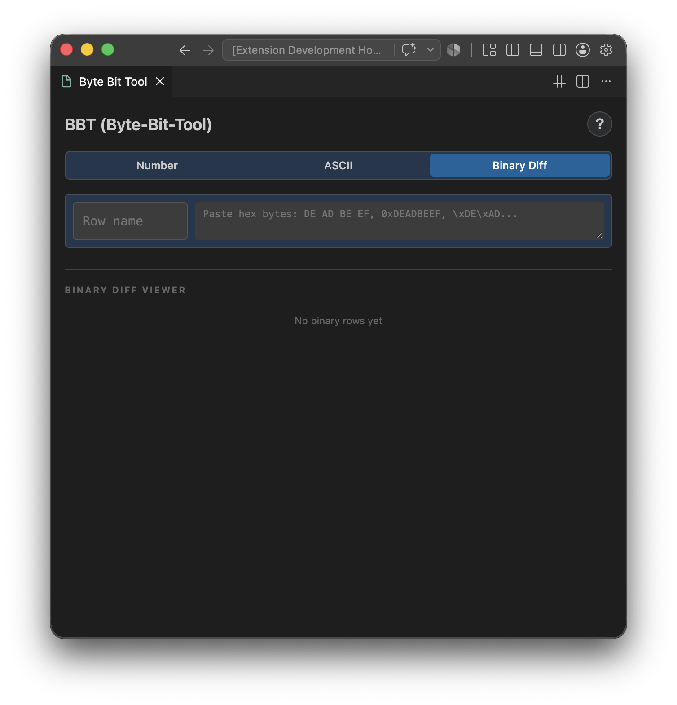
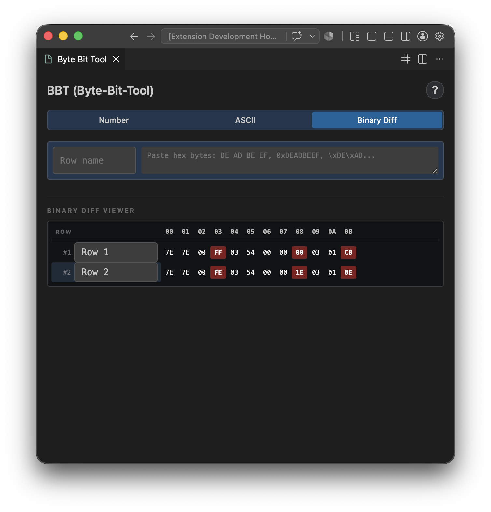

# Byte Bit Tool (BBT)

[](https://opensource.org/licenses/MIT)
[](https://github.com/MishaelS/bbt-extension/releases)

Byte Bit Tool is a VS Code extension for developers, reverse engineers, and security researchers. Convert numbers between decimal, hexadecimal, and binary, evaluate arithmetic and bitwise expressions, inspect ASCII codes, and compare hex dumps — directly in your editor.

## Screenshots

Number mode with expression evaluation, integer type checker, bit visualizer and endianness display.




ASCII mode with hex/decimal codes and character cards.




Binary Diff mode for comparing hex dumps byte by byte.




## Demo

Number & ASCII mode demonstration.


## Features

### Number Mode
Expression evaluation with support for DEC (42), HEX (0xFF, xFF), and BIN (0b1010, b1010) literals.

| Category   | Operators |
|------------|-----------|
| Arithmetic | `+` `-` `*` `/` `%` |
| Bitwise    | `&` `\|` `^` `~` `<<` `>>` `>>>` |
| Grouping   | `(` `)` |

**Auto-Completion:**
- Type `(` → automatically inserts `()` with cursor inside
- Type `<` → inserts `<<` operator
- Type `>` → inserts `>>` operator

**Output Features:**
- **DEC** - Decimal result
- **HEX** - Hexadecimal with byte padding
- **BIN** - Binary with byte grouping (8 bits per group)
- **Integer Types** - Shows which integer types (int8/16/32, uint8/16/32) the value fits into
- **Bit Visualization** - Visual representation of bits (8/16/32 bits)
- **Endianness** - Big/Little Endian byte order for multi-byte values

### ASCII Mode
Convert between plain text and hexadecimal/decimal ASCII codes.

- Auto-detects input type: plain text, hex codes, or decimal codes
- Character cards with click-to-copy
- Direction indicator shows conversion type

### Binary Diff Mode (NEW in v0.0.7)
Compare multiple binary/hex strings byte by byte.

**Visual Indicators:**
- 🟢 **Green** - Byte matches all other rows
- 🔴 **Red** - Byte differs from other rows
- 🟡 **Yellow** - Missing byte in this row
- 🔵 **Blue/Purple/Cyan** - Manual marks (click to cycle)

**Supported Input Formats:**
- `DE AD BE EF` - Space separated
- `0xDE,0xAD,0xBE,0xEF` - With 0x prefix
- `DEADBEEF` - Continuous hex string
- `\xDE\xAD\xBE\xEF` - C-style escapes
- `DE-AD-BE-EF` - With dashes

**Keyboard Shortcuts:**
| Shortcut | Action |
|----------|--------|
| `Delete` | Remove selected row(s) |
| `Ctrl+Delete` | Remove all rows |
| `Ctrl+Up/Down` | Move selected rows |
| `Ctrl+Click` | Multi-select rows |

**Features:**
- Export/Import rows as JSON
- Manual byte marking
- Column header indicators (● = all same, ◆ = has differences)
- Click on byte to copy its value

### Help System
Click the `?` button in the title bar to open interactive help with usage instructions for all modes.

### Hover Provider
Hover over any number in your code to see conversions. Works with DEC, HEX, and BIN literals (including short forms). Output is colored for readability.

### Calculation History
Last 20 calculations are saved. Click any history entry to restore the expression. Clear button resets history. Auto-save can be enabled in settings.

## Installation

### From VSIX (Recommended)
1. Download the latest `.vsix` file from [Releases](https://github.com/MishaelS/bbt-extension/releases)
2. Open VS Code
3. Go to Extensions (Ctrl+Shift+X)
4. Click "..." menu → "Install from VSIX..."
5. Select the downloaded file

### From Source
```bash
# Copy the repository
git clone https://github.com/MishaelS/bbt-extension.git

# Go to the repository
cd bbt-extension

# Install dependencies
npm install

# Compile TypeScript
npm run compile

# Package as .vsix
npm run package

# Install via command line
code --install-extension byte-bit-tool-*.vsix
```

## Usage

### Open the tool via:

- BBT icon in the Activity Bar
- Ctrl+Shift+B (Windows/Linux) or Cmd+Shift+B (Mac)
- Command Palette → "Byte Bit Tool: Open"

### Number Mode Examples

| Expression           | Result DEC | Result HEX | Result BIN |
|----------------------|------------|------------|------------|
| `xFF + 1`            | 256        | 0x100      | 0b100000000
| `b1010 & b1100`      | 8          | 0x8        | 0b1000
| `xF0 >> 4`           | 15         | 0xF        | 0b1111
| `(x10 << 8) \| 0x31` | 4145       | 0x1031     | 0b1000000110001

### ASCII Mode Examples

| Expression                  | Result TEXT | Result HEX               | Result DEC |
|-----------------------------|-------------|--------------------------|------------|
| `Hello`                     |             | 0x48 0x65 0x6C 0x6C 0x6F | 72 101 108 108 111
| `0x48 0x65 0x6C 0x6C 0x6F`  | Hello       |                          |
| `72 101 108 108 111`        | Hello       |                          |

### Binary Diff Mode Examples

Add rows with hex data:
```bash
Row 1: 7E 7E 00 FF 03 54 00 00 00 03 01 C8
Row 2: 7E 7E 00 FE 03 54 00 00 1E 03 01 0E
```

The table will highlight differences in red and matching bytes in green.

### Hover Feature

Open any code file and hover over numbers like 42, 0xFF, or 0b1010. A tooltip will show conversions to other formats.

### Copy Results

Click the Copy button next to any result. The value is copied to clipboard. The button briefly shows "ok" as confirmation.

### Calculation History

Last 20 calculations are saved automatically when auto-save is enabled in settings. When auto-save is disabled, press Enter to save the current calculation. Click any history item to reload the expression. Use the clear button to reset history.

## Settings

| Setting | Default | Description |
|---------|---------|-------------|
| `byteBitTool.autoSave` | `false` | Automatically save calculations to history while typing. When disabled, press Enter to save.

## Keyboard Shortcuts

Open Byte Bit Tool: Ctrl+Shift+B (Windows/Linux) or Cmd+Shift+B (Mac)

## Supported Number Formats

* `Decimal:`     42, -10, 255
* `Hexadecimal:` 0xFF,   0xDEADBEEF, **xFF   (short form)**
* `Binary:`      0b1010, 0b11110000, **b1010 (short form)**

## Integer Type Ranges

* `int8:`   -128 to 127
* `int16:`  -32768 to 32767
* `int32:`  -2147483648 to 2147483647
* `uint8:`  0 to 255
* `uint16:` 0 to 65535
* `uint32:` 0 to 4294967295

## Requirements

VS Code version 1.80.0 or higher

## Release Notes

See CHANGELOG.md for version history.