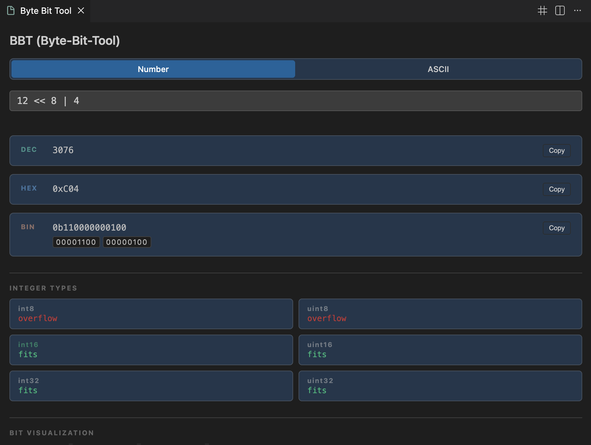
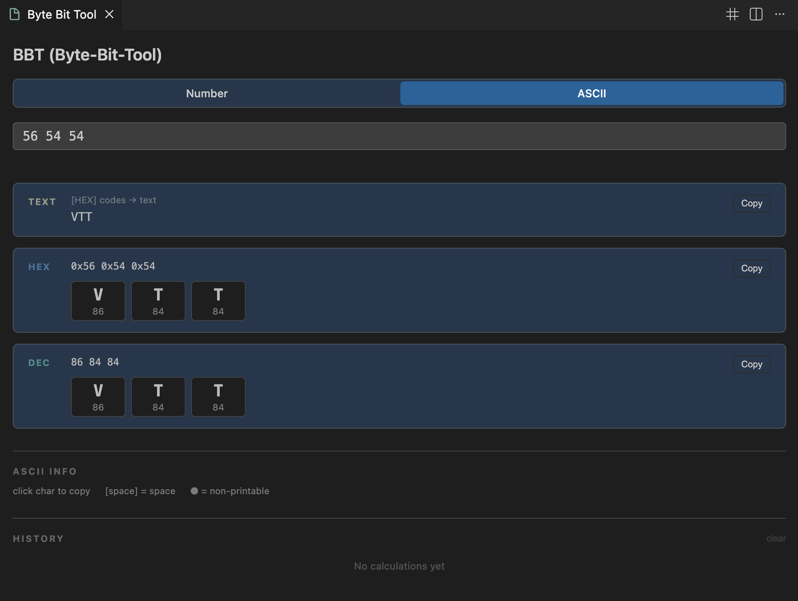

# Byte Bit Tool (BBT)

[](https://marketplace.visualstudio.com/items?itemName=mishaels.byte-bit-tool)
[](https://marketplace.visualstudio.com/items?itemName=mishaels.byte-bit-tool)
[](https://marketplace.visualstudio.com/items?itemName=mishaels.byte-bit-tool)
[](https://opensource.org/licenses/MIT)

Byte Bit Tool is a VS Code extension for developers, reverse engineers, and security researchers. Convert numbers between decimal, hexadecimal, and binary, evaluate arithmetic and bitwise expressions, and inspect ASCII codes — directly in your editor.

## Screenshots

Number mode with expression evaluation, integer type checker, bit visualizer and endianness display.



ASCII mode with hex/decimal codes and character cards.



## Demo

Number & ASCII mode demonstration.


## Features

Number conversion with expression evaluation. Supports DEC (42), HEX (0xFF), and BIN (0b1010) literals.

| Category   | Operators |
|------------|-----------|
| Arithmetic | `+` `-` `*` `/` `%` |
| Bitwise    | `&` `\|` `^` `~` `<<` `>>` `>>>` |
| Grouping   | `(` `)` |

ASCII conversion. Input plain text to get hex and decimal codes. Input hex codes (0x48 0x65 0x6C 0x6C 0x6F) or decimal codes (72 101 108 108 111) to get decoded text. Output includes character cards for each code point.

Integer type checker. Shows whether the current value fits into int8, uint8, int16, uint16, int32, or uint32. The smallest fitting type is highlighted.

Bit visualizer. Displays individual bits with position indices. Width auto-expands from 8 to 16 to 32 bits as needed. Set bits are highlighted.

Endianness display. For values larger than one byte (greater than 0xFF), shows both Big Endian and Little Endian byte layouts. The most significant byte is highlighted.

Calculation history. Last 20 calculations are saved. Click any history entry to restore the expression. Clear button resets history. Auto-save can be enabled in settings.

Hover provider. Hover over any number in your code to see conversions. Works with DEC, HEX, and BIN literals. Output is colored for readability.

## Installation

1. Select and download a version https://github.com/MishaelS/bbt-extension/releases
2. Open VS Code
3. Go to Extensions (Ctrl+Shift+X)
4. Click "..." menu -> "Install from VSIX..."
5. Select the downloaded file

### Or install via command line
```bash
code --install-extension {Name of the plugin}
```

## Usage

Open the tool via the BBT icon in the Activity Bar, press Ctrl+Shift+B (Windows/Linux) or Cmd+Shift+B (Mac), or run command "Byte Bit Tool: Open" from the Command Palette.

### Number Mode Examples

| Expression           | Result DEC | Result HEX | Result BIN |
|----------------------|------------|------------|------------|
| xFF + 1              | 256        | 0x100      | 0b100000000
| b1010 & b1100        | 8          | 0x8        | 0b1000
| xFF + b1             | 256        | 0x100      | 0b100000000

### ASCII Mode Examples

| Expression                  | Result TEXT | Result HEX               | Result DEC |
|-----------------------------|-------------|--------------------------|------------|
| "Hello"                     |             | 0x48 0x65 0x6C 0x6C 0x6F | 72 101 108 108 111
| "0x48 0x65 0x6C 0x6C 0x6F"  | Hello       |                          |
| "72 101 108 108 111"        | Hello       |                          |

### Hover Feature

Open any code file and hover over numbers like 42, 0xFF, or 0b1010. A tooltip will show conversions to other formats.

### Copy Results

Click the Copy button next to any result. The value is copied to clipboard. The button briefly shows "ok" as confirmation.

### Calculation History

Last 20 calculations are saved automatically when auto-save is enabled in settings. When auto-save is disabled, press Enter to save the current calculation. Click any history item to reload the expression. Use the clear button to reset history.

## Settings

byteBitTool.autoSave (boolean, default: false) - Automatically save calculations to history while typing. When disabled, press Enter to save.

## Keyboard Shortcuts

Open Byte Bit Tool: Ctrl+Shift+B (Windows/Linux) or Cmd+Shift+B (Mac)

## Supported Number Formats

* `Decimal:`     42, -10, 255
* `Hexadecimal:` 0xFF,   0xDEADBEEF, **xFF   (short form)**
* `Binary:`      0b1010, 0b11110000, **b1010 (short form)**

## Integer Type Ranges

* `int8:`   -128 to 127
* `int16:`  -32768 to 32767
* `int32:`  -2147483648 to 2147483647
* `uint8:`  0 to 255
* `uint16:` 0 to 65535
* `uint32:` 0 to 4294967295

## Requirements

VS Code version 1.80.0 or higher

## Release Notes

See CHANGELOG.md for version history.